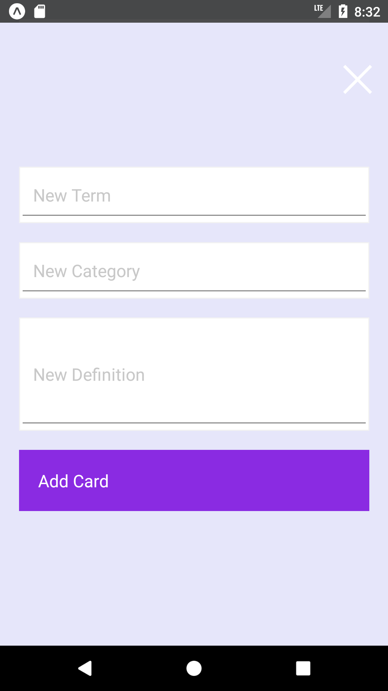
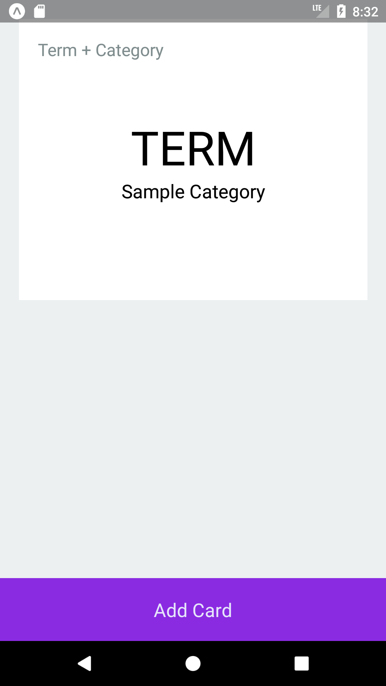
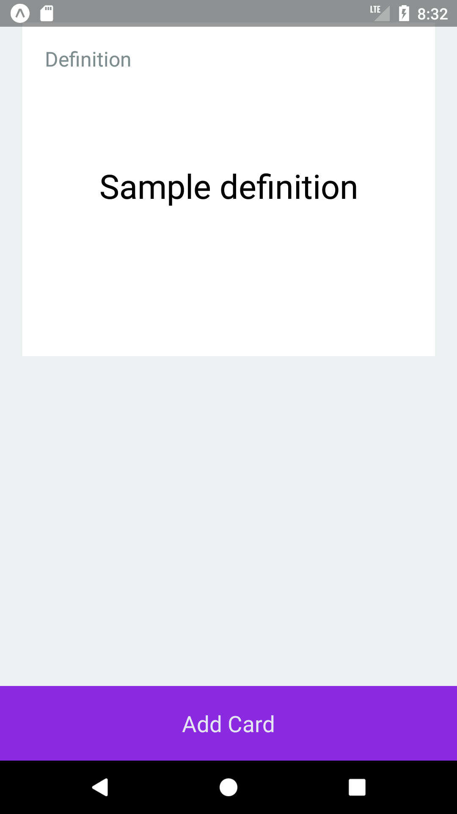

## Flashcards (Scope Lesson 2)

This is an updated version of Scope Lesson 2's React Native flashcards.

Updates include:
* Added new text- "Category", that displays with term
* Made app purple cause scope 

Screens from the app:

@WilhelmWillie
